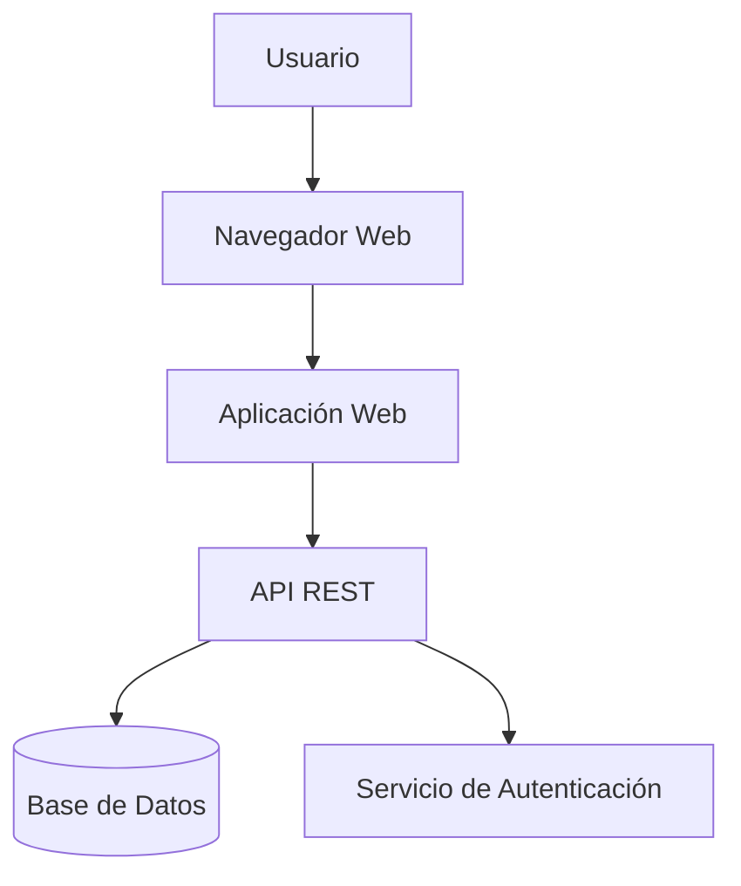
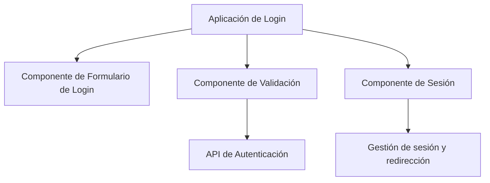
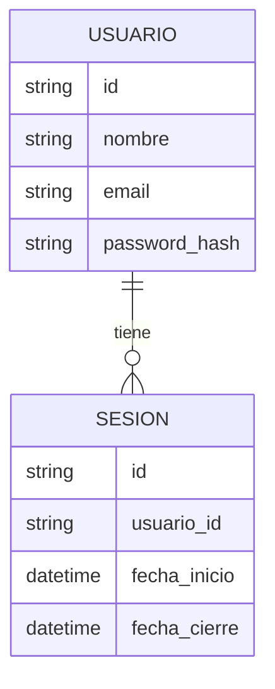

# Diagramas de Arquitectura (Mermaid)

## 🧱 Diagrama de Infraestructura

```mermaid
graph TD
    User[Usuario] --> Browser[Navegador Web]
    Browser --> WebApp[Aplicación Web]
    WebApp --> API[API REST]
    API --> DB[(Base de Datos)]
    API --> Auth[Servicio de Autenticación]
```

## 🧩 Diagrama de Componentes

```mermaid
graph TD
    App[Aplicación de Login]
    App --> Formulario[Componente de Formulario de Login]
    App --> Validacion[Componente de Validación]
    App --> Sesion[Componente de Sesión]
    Validacion --> AuthAPI[API de Autenticación]
    Sesion --> Almacenamiento[Gestión de sesión y redirección]
```

## 🗃️ Diagrama de Base de Datos

```mermaid
erDiagram
    USUARIO ||--o{ SESION : tiene
    USUARIO {
        string id
        string nombre
        string email
        string password_hash
    }
    SESION {
        string id
        string usuario_id
        datetime fecha_inicio
        datetime fecha_cierre
    }
```
