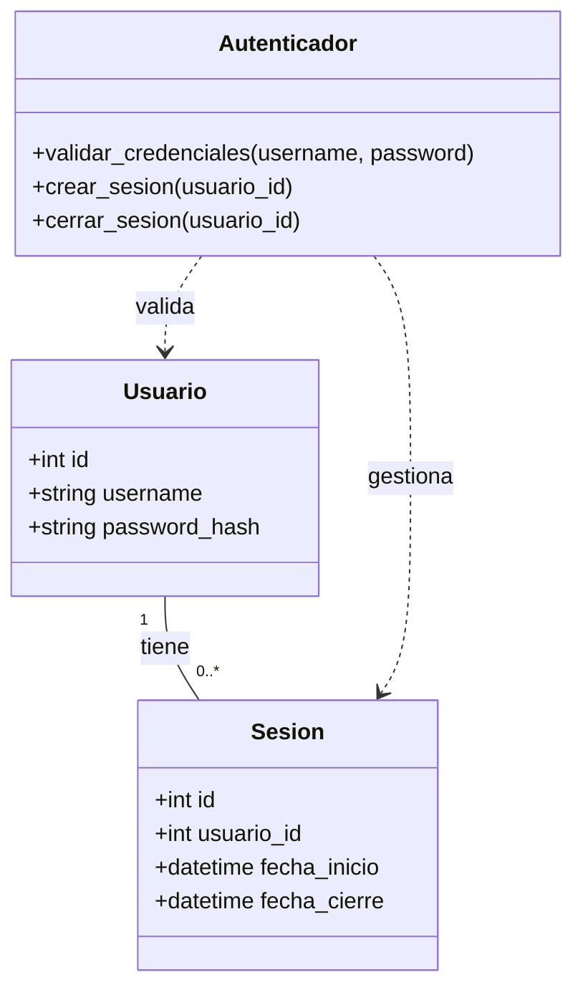
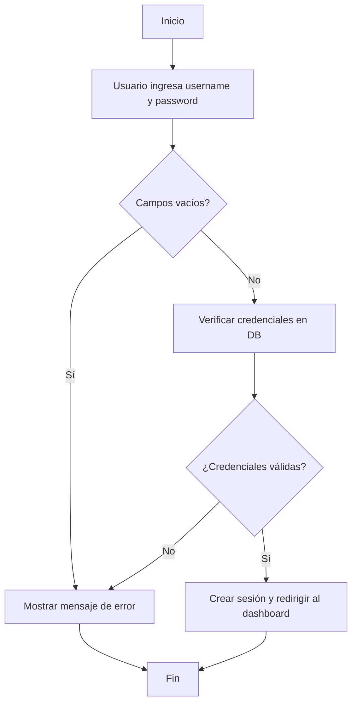

# 🧱 Diagrama de Clases

```mermaid
classDiagram
    class Usuario {
        +int id
        +string username
        +string password_hash
    }

    class Sesion {
        +int id
        +int usuario_id
        +datetime fecha_inicio
        +datetime fecha_cierre
    }

    class Autenticador {
        +validar_credenciales(username, password)
        +crear_sesion(usuario_id)
        +cerrar_sesion(usuario_id)
    }

    Usuario "1" -- "0..*" Sesion : tiene
    Autenticador ..> Usuario : valida
    Autenticador ..> Sesion : gestiona
```

# 🔁 Diagrama de Flujo del Login

```mermaid
flowchart TD
    A[Inicio] --> B[Usuario ingresa username y password]
    B --> C{Campos vacíos?}
    C -- Sí --> F[Mostrar mensaje de error]
    C -- No --> D[Verificar credenciales en DB]
    D --> E{¿Credenciales válidas?}
    E -- Sí --> G[Crear sesión y redirigir al dashboard]
    E -- No --> F
    F --> H[Fin]
    G --> H
```
