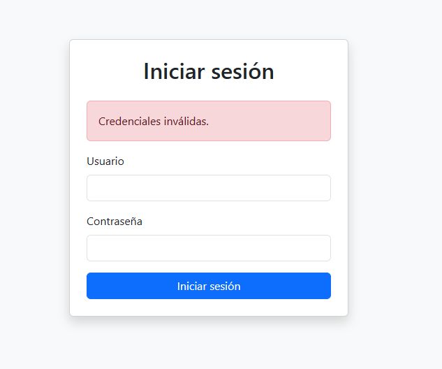

<h1 align="center">💻 Proyecto Final QA 4.0 - Sistema de Login (VIAG)</h1>

<p align="center">
  
  
  
  
</p>

---

## 📋 Descripción

Este proyecto fue desarrollado como entrega final del curso **QA 4.0**, aplicando el modelo **VIAG** (Modelo V + IA Generativa).  
Consiste en un sistema de login hecho en **Flask + SQLite**, con validación, gestión de sesiones y pruebas automatizadas con **Selenium**.

---

## 📁 Estructura del Proyecto

```bash
├── app.py                         # App principal en Flask
├── usuarios.db                    # Base de datos SQLite
├── templates/
│   ├── login.html                 # Interfaz de inicio de sesión
│   └── dashboard.html             # Pantalla de bienvenida
├── test_login.py                  # Prueba básica de login
├── test_login_completo.py         # Pruebas completas de login y errores
├── .gitignore                     # Exclusiones para Git
├── README.md                      # Este archivo
├── Proyecto_Login_VIAG.xlsx       # Requerimientos y pruebas de aceptación
├── Seguimiento_Errores_Login.xlsx # Registro de errores detectados
├── Diseno_Sistema_Login.xlsx      # Pantallas y pruebas de sistema
├── Casos_Prueba_Integracion.xlsx  # Pruebas de integración
├── Casos_Prueba_Modular.xlsx      # Pruebas modulares
├── Diagramas_Arquitectura_VIAG.md # Infraestructura, componentes y BD
└── Diagramas_Modular_VIAG.md      # Clases y flujo de login
```

---

## 🧪 Pruebas Automatizadas con Selenium

Incluye pruebas para:
- ✅ Login exitoso
- ❌ Credenciales incorrectas
- ⚠️ Campos vacíos
- 🔒 Acceso restringido al dashboard
- 🔁 Cierre de sesión

---

## 🧠 Modelo VIAG aplicado

- **V:** Validación completa del sistema con pruebas unitarias, de integración y aceptación.
- **IA Generativa:** Uso de inteligencia artificial para la generación de requerimientos, pruebas y documentación.

---

## 🧰 Tecnologías utilizadas

- Python 3.11
- Flask
- SQLite
- Selenium
- Bootstrap 5
- Mermaid (para diagramas)

---

## 📸 Captura del sistema

<p align="center">
  
</p>

> Puedes reemplazar la imagen subiendo una captura al repositorio y enlazándola en el README.

---

## 👤 Autor

**Edgar DLG**  
🔗 [github.com/EdgarDLG33](https://github.com/EdgarDLG33)

---

## 📥 ¿Cómo ejecutar?

```bash
pip install flask werkzeug selenium
cd login_app
python app.py
```

---

## 💬 ¿Dudas o comentarios?

¡Con gusto puedes abrir un issue o contactarme por GitHub! 🙌
